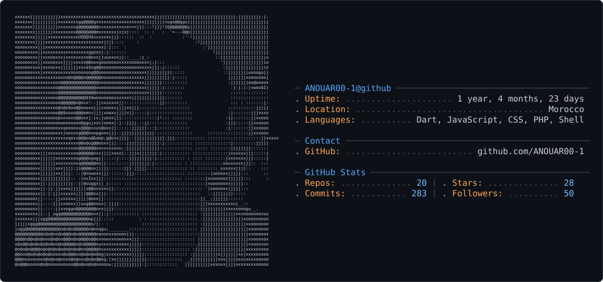

# ANOUAR BENTAHAR — GitHub Profile README

<picture>
  <source media="(prefers-color-scheme: dark)" srcset="dark_mode.svg" />
  <source media="(prefers-color-scheme: light)" srcset="light_mode.svg" />
  
</picture>

 

# 👋 Hi, I'm Anouar Bentahar

### Full-Stack Developer | SaaS Architect | AI Systems Builder

I'm a product-oriented Full-Stack Developer specialized in building **SaaS platforms, CRM systems, AI-powered applications, and scalable web/mobile products**.

I work across the full product lifecycle — from architecture and database design to authentication, APIs, payments, real-time features, deployment, performance, and user experience.

My main stack includes **TypeScript, React, Next.js, Node.js, Laravel, PostgreSQL**, and modern AI integrations.

---

##  What I Do

*  Design scalable **SaaS and multi-tenant architectures**
*  Build modern applications with **React, Next.js & TypeScript**
*  Develop robust backends with **Node.js & Laravel**
*  Design relational and NoSQL database architectures
*  Implement authentication, authorization, RBAC and API security
*  Integrate **LLMs, AI agents, MCP and tool calling**
*  Build payment and subscription systems with **Stripe**
*  Optimize application performance and scalability
*  Build cross-platform applications with **React Native / Expo**
*  Work with Docker, Redis, CI/CD and production infrastructure

---

##  Professional Experience

### Full-Stack Developer — NexCore Solutions

**USA · Freelance · Mar 2026 – Apr 2026**

* Developed a web platform for an American AI and automation agency using **React 18, TypeScript and Tailwind CSS**.
* Improved frontend performance through code splitting, SEO optimization and Lighthouse improvements.
* Implemented modern UI/UX interactions using **GSAP and Framer Motion**.

### Full-Stack Developer — GEOREF

**Freelance · Nov 2025 – Jan 2026**

* Developed a technical web platform for a company specialized in **geomatics, drone mapping and BIM**.
* Built a responsive and high-performance interface with **React 18, TypeScript and Tailwind CSS**.
* Focused on clarity, usability and performance for a professional technical audience.

---

##  Featured Projects

### ✈️ Aetherline

**AI-Powered Full-Stack Airline Reservation Platform**

`React 19` `TypeScript` `Node.js` `Prisma` `PostgreSQL` `Stripe` `OAuth` `JWT` `SSE` `AI`

* Built a complete airline reservation platform with real-time flight tracking.
* Integrated **Stripe payments**, OAuth/JWT authentication and RBAC authorization.
* Developed an AI assistant using a 4-layer architecture:

`FAQ → RAG with pgvector → LLM → Tool Calling`

* The assistant can query and interact with user reservations in real time.

---

### 📦 WMS Multi-Tenant

**Mini ERP & Warehouse Management System**

`Laravel 12` `React 19` `TypeScript` `MySQL` `Redis` `Docker` `React Query` `Zustand`

* Built a multi-tenant WMS / Mini ERP covering:

  * Inventory
  * Purchases
  * Sales
  * Suppliers
  * Customers
  * Billing
  * Payments
  * B2B portal
* Developed a transactional stock engine supporting:

  * Reservations
  * Transfers
  * Lots
  * Unit conversions
  * Pessimistic locking
  * Immutable stock movement journal

---

### 🎓 SmartSchool

**School Management CRM**

`React 19` `TypeScript` `Laravel 12` `Tailwind CSS` `OCR` `Sanctum` `JWT`

* Built a multi-module CRM for:

  * Admissions
  * Billing
  * Customer support
* Developed a Laravel REST API with OCR extraction for invoice data.
* Implemented security using Sanctum, JWT, rate limiting and application-level protections.

---

### 🎮 GameVault

**Social Platform for Video Games**

`React 18` `Laravel 11` `RAWG API` `PostgreSQL` `TanStack Query`

* Built a social gaming platform powered by the **RAWG API with 500,000+ games**.
* Implemented advanced state management and optimized data fetching.
* Designed the PostgreSQL data layer and secured the API using Laravel Sanctum/OAuth.
* Added full internationalization with RTL support.

---

### 🤖 PixFusion AI Studio

**AI Media Generation SaaS**

`Next.js 15` `TypeScript` `AI APIs` `Stripe` `Auth.js v5` `Neon PostgreSQL`

* Architected a SaaS platform for **AI image and video generation**.
* Integrated Stripe monetization.
* Implemented authentication with Auth.js v5.
* Added persistent generation history using Neon/PostgreSQL.

---

## 🧰 Tech Stack

### Frontend

### Backend

### Databases & APIs

### Mobile

### DevOps & Tools

---

##  AI Engineering

I'm actively working with:

* Large Language Model APIs
* AI Agents
* MCP — Model Context Protocol
* Tool Calling
* Retrieval-Augmented Generation (RAG)
* `pgvector`
* Prompt Engineering
* Groq
* Llama

---

##  Security

Experience implementing:

* OAuth
* JWT
* Laravel Sanctum
* RBAC
* Authentication & Authorization
* Rate Limiting
* Secure REST APIs
* Application security best practices

---

##  Education & Certifications

### Education

**Diplôme de Technicien Spécialisé en Développement Digital — Option Full Stack**
2024 – 2026

**Bac+1 — Sciences économiques et gestion**
FSJES Ibn Zohr, Agadir · 2022 – 2023

**Baccalauréat Scientifique — SVT**
2021 – 2022

### Certifications

**Anthropic**

* Claude Code in Action
* Introduction to Model Context Protocol (MCP)
* Introduction to Agent Skills

---

##  Languages

* 🇬🇧 **English:** Technical working proficiency
* 🇫🇷 **French:** Intermediate
* 🇲🇦 **Arabic:** Native

---

##  GitHub

---

##  Connect With Me

 **Portfolio:** [www.anwar.engineer](https://www.anwar.engineer)

 **GitHub:** [ANOUAR00-1](https://github.com/ANOUAR00-1)

 **LinkedIn:** ANOUAR BENTAHAR

 **Email:** [b.anouar.officiel@gmail.com](mailto:b.anouar.officiel@gmail.com)

---

> Building scalable products, clean architectures and intelligent systems.

